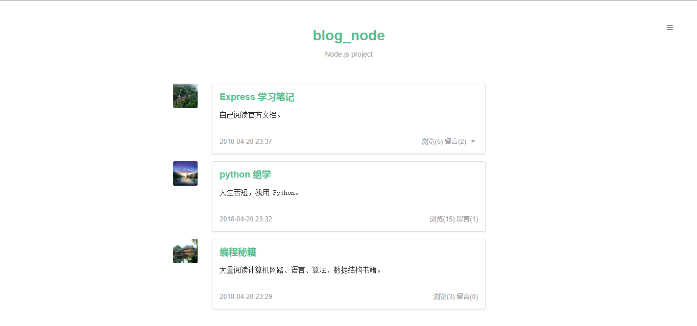

## 博客站点
使用 Node + Express 搭建的博客站点。

此项目是学习 Express 所写的站点，参考的是
[nswbmw](https://github.com/nswbmw)
所编写的开源教程 [《一起学 Node.js》](https://github.com/nswbmw/N-blog)。

## 相关技术栈 ( 开发环境 )
- Node `v 8.11.1`
- Express `v 4.16.3`
- MongoDB `v 3.6.4`
- Mongolass ( mongodb 驱动库 | node version need >= 8.x.x )
- Ejs

## 项目结构
> 目录结构为自己手动构建。

- **config** （存放配置文件）

- **lib** （存放数据库模型文件）

- **logs** （存放日志文件 | 使用模块 `winston & express-winston`）

- **middlewares** （存放公用中间件）

- **models** （存放操作数据库的文件）

- **public** （存放静态文件，如样式、图片等）

- **routes** （存放路由文件）

- **test** （存放测试文件 | 使用模块 `mocha & supertest`）

- **views** （存放模板文件）

- **index.js** （程序主文件 | 程序入口）

- **package.json** （项目名、描述、作者、相关依赖等信息）

> 项目运行 （ 运行前需保证安装并运行 MongoDB ）

```bash
# download
>$ git clone https://github.com/hanyucd/blog_node.git

# install dependencies
>$ npm install

# run
>$ node index.js

```

## 项目展示

